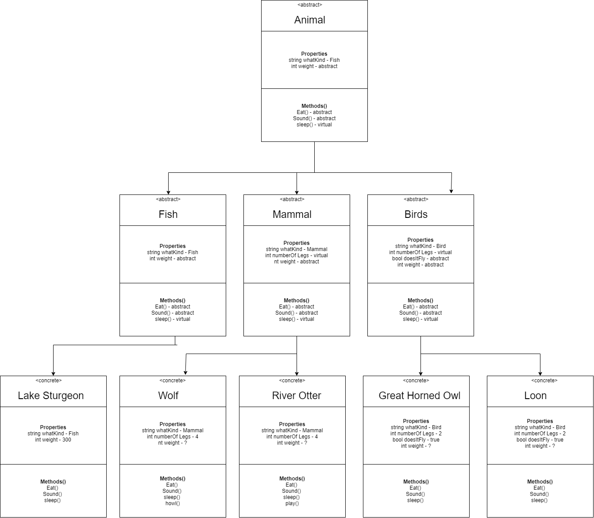

# Lab06-Zoo
Building  a zoo in C# using classes and inheritance

**Summary**
- This application uses abstract classes with abstract and abstract/virtual method to populate a zoon with many different
kinds of animals.

**UML**

**OOP Principles**
- Encapsulation: breaking apart and dividing related data and fuctions into classes which can be instanitated into objects
  - This program uses abstract classes for Animal, and then the basic types to create the general blueprints then uses the 
	more specific classes such as Wolf to create a specific object.

- PolyMorphism: greek for "many forms," this is describes how a class can be transforms into many different objects with varied 
properties
  - This program uses polymorphism extensively, not allow does the hierachy of animal to types of animals classes allow the creation
  of varied concrete classes which can be used to create varied objects. The methods that start in the Animal class are overridden 
  in the concrete class to have unique outputs

- Inheritance: properties and methods are passed down to children classes and then to the objects.
  - the principle of inheritance is used to passed down common data points and methods down from the Animal class to the types 
  classes before they are intialized in the individual animal classes.

- Abstraction: The goal of OOP is to abstract our code so that we can focus on higher level concepts instead of being bogged 
down by the implementation of basic ideas
  - This programs takes the idea of an animal object, abstracts its properties and actions into a type class, such as mammal,
  then it abstractions the notion futher into the basic common animal properties and methods